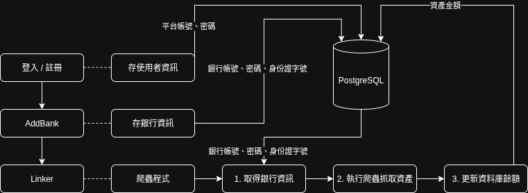
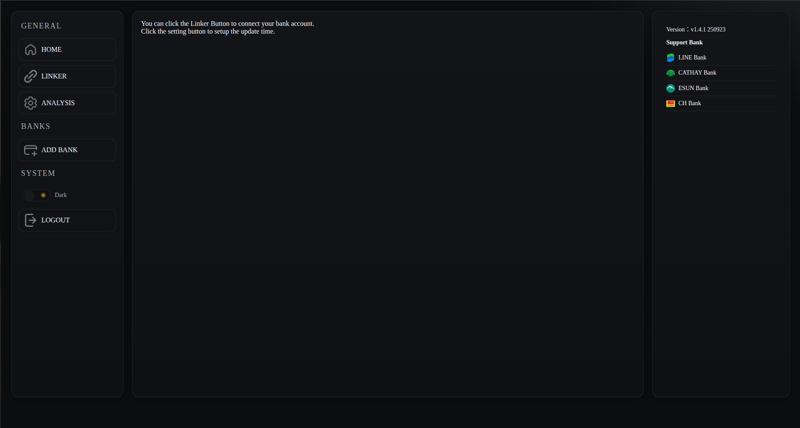
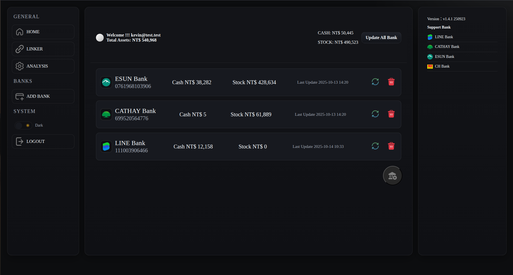
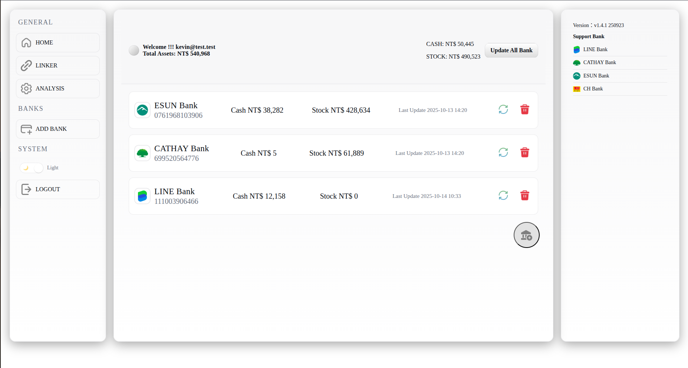
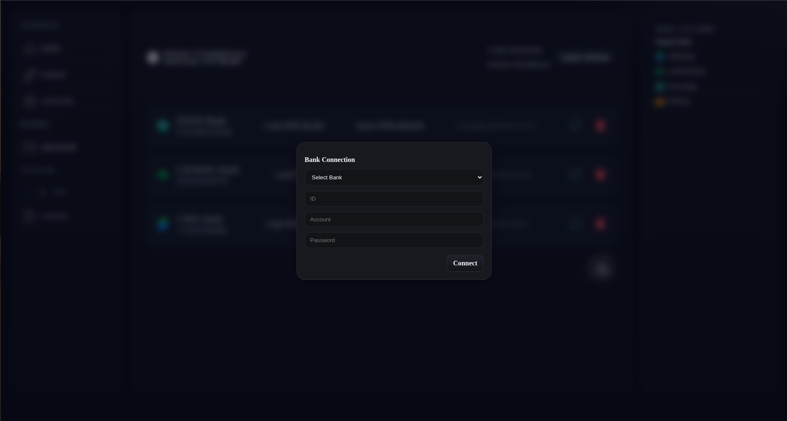

# BankLinker    

## 用途  

* 使用者可以在這個平台連接自己的銀行帳戶，實現一鍵彙整所有銀行帳戶訊息
* 蒐集現金 股票市值並彙整

## 架構  

* Frontend: React  
* Backend: FastAPI  
* Database: PostgreSQL  
* OS: Ubuntu 24.04 LTS  

    

## 前端介面

* 登入介面

    

* 主畫面

    

* Linker

    
    

* 連接銀行

    